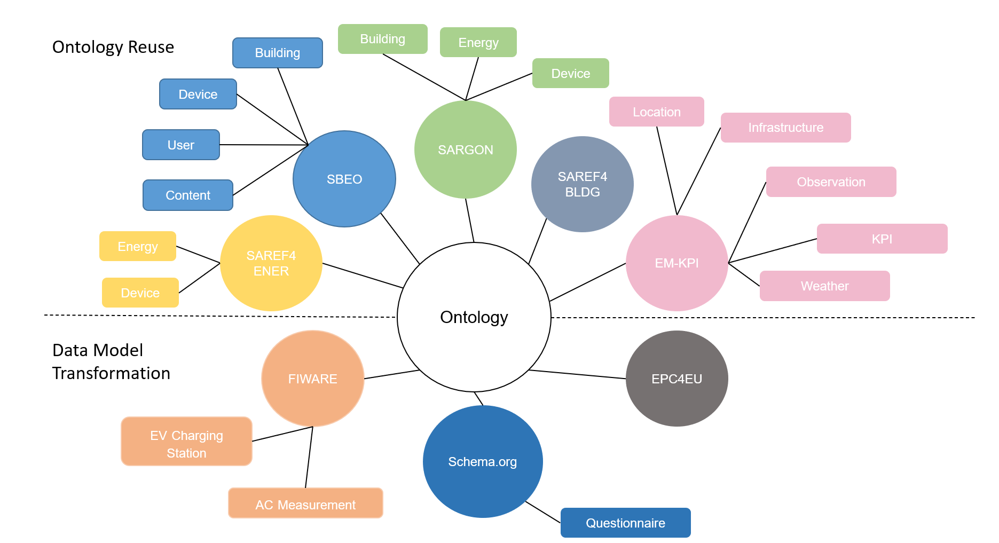
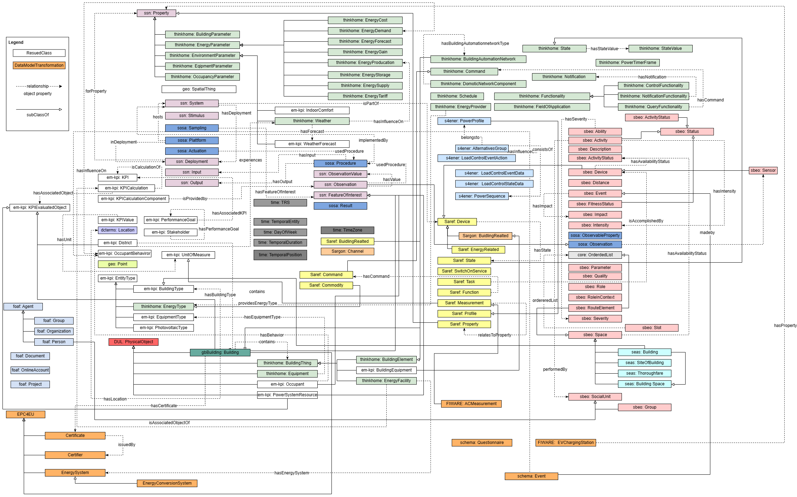

# Building Energy Ontology

### Overview
The Figure below shows the concepts of our ontology. The final ontology has two parts:
ontology reuse and data model. Various concepts from the existing ontologies are
reused such as SAREF4ENER, SAREF4BLDG, SBEO, SARGON, and EM-KPI
Ontology. The data model of Questionnaire, ACMeasurement, EPC, and EVCharg-
ingSation are also integrated into this ontology. 

### The core concepts of the ontology

